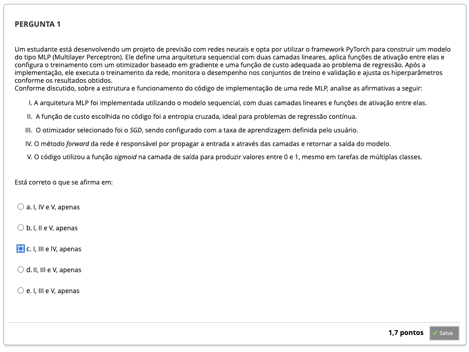

# Semana 3 - Redes Neurais Multiplayer Perceptron (MLP) e o Algoritmo de Retropropagação

##
### Texto-base 1
### Texto-base 2
### Texto-base 3

### Videoaula 7 - A Arquitetura da Rede Multilayer Perceptron
#### Quiz - videoaula 7

### Texto-base 4
### Texto-base 5

### Videoaula 8 - Fundamentos e Derivação do Algoritmo de Retropropagação
#### Quiz - videoaula 8

### Texto-base 6

### Videoaula 9 - Exemplos Práticos de Implementação e Aplicação de Redes MLP
#### Quiz - videoaula 9

---

## Quiz Objeto Educacional

---

### Exercício de Apoio - MLP 01
### Exercício de Apoio - MLP 02

---

## Aprofundando o Tema
###
###
###
###
###
###

---

## Em Síntese

---

## Atividade Avaliativa - Semana 3

<!--  -->