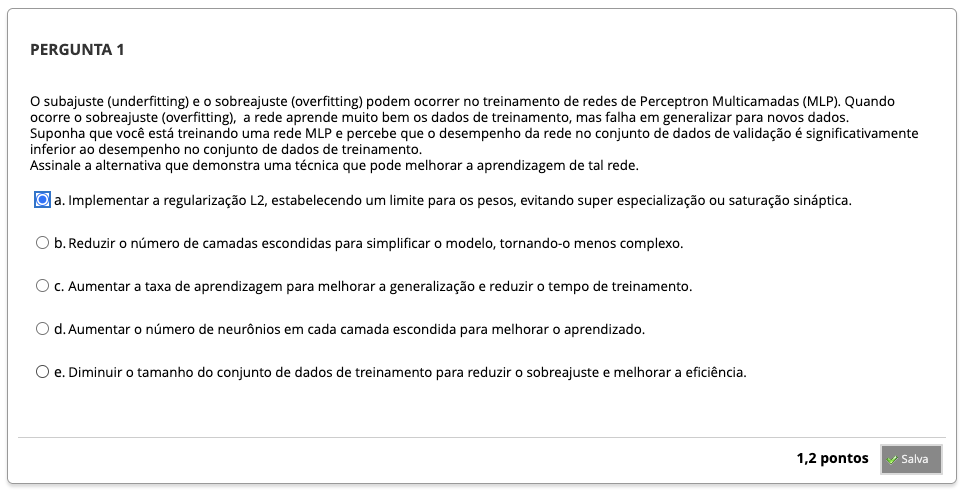
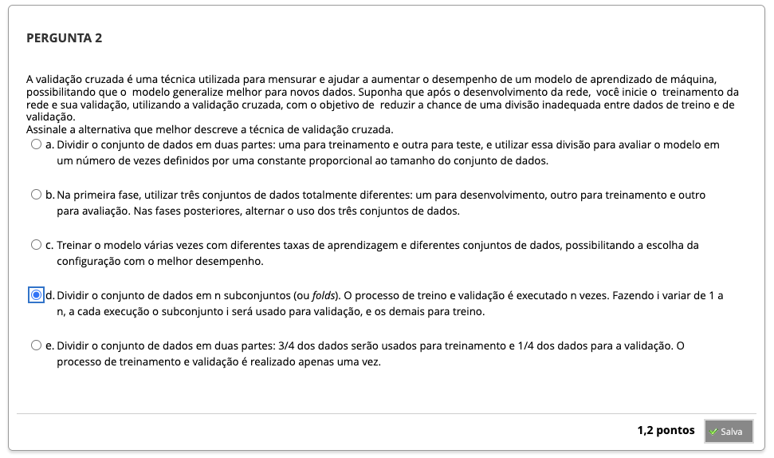
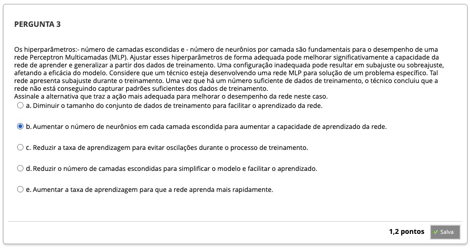
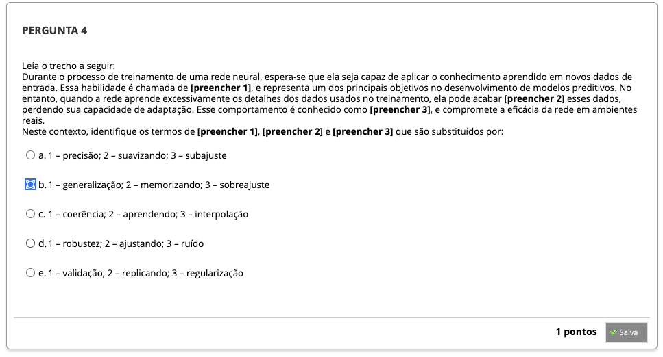
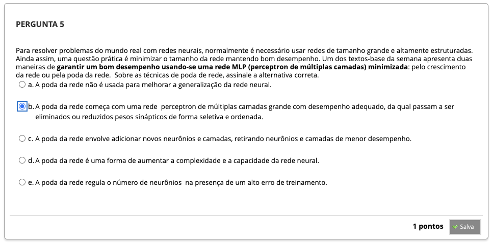
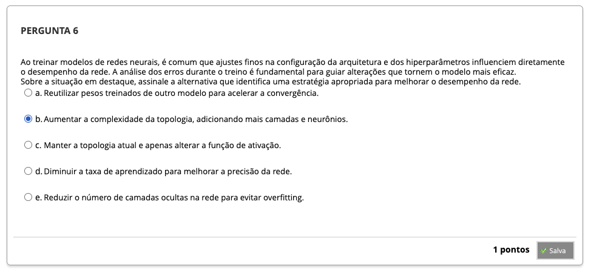
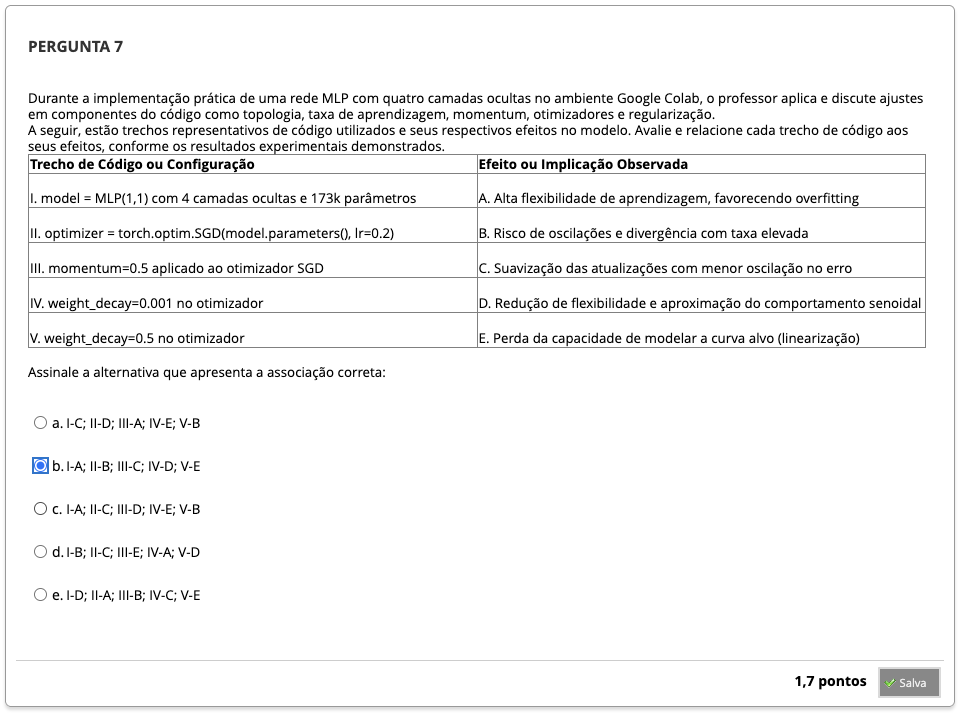

# Semana 4 - Otimização, Treinamento e Regularização em Redes MLP

## 
### Texto-base 1
### Texto-base 2
### Videoaula 10 - Configuração dos hiperparâmetros de uma rede MLP
#### Quiz - videoaula 10
### Texto-base 3
### Texto-base 4
### Texto-base 5
### Texto-base 6
### Videoaula 11 - Métodos otimizados para treinamento das redes MLP e regularização
#### Quiz - videoaula 11
### Videoaula 12 - Ilustração da otimização da topologia de uma rede MLP
#### Quiz - videoaula 12

---
## Quiz Objeto Educacional
---

## Exercício de Apoio - MLP

---

## Aprofundando o Tema

---

## Em Síntese

---

### Atividade Avaliativa - Semana 4

