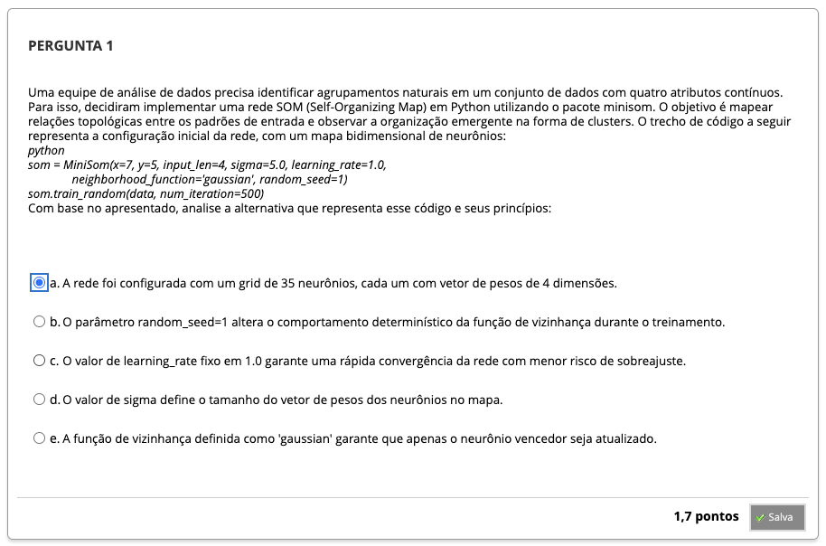
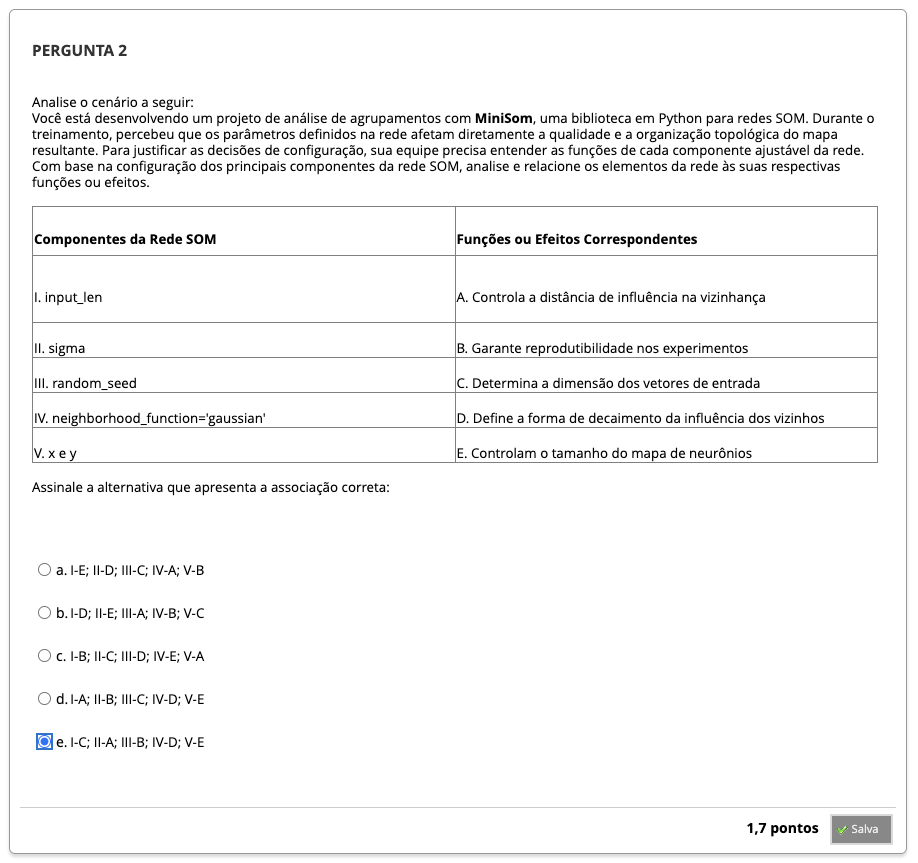
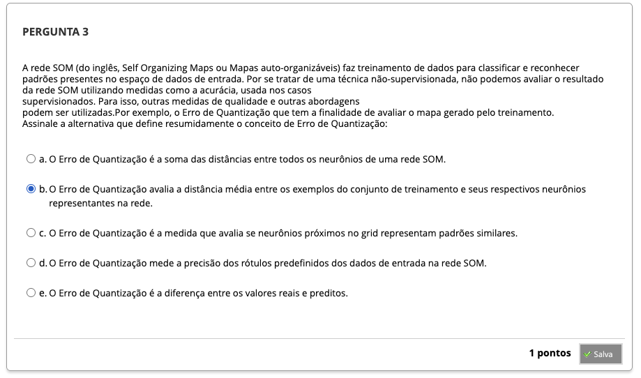
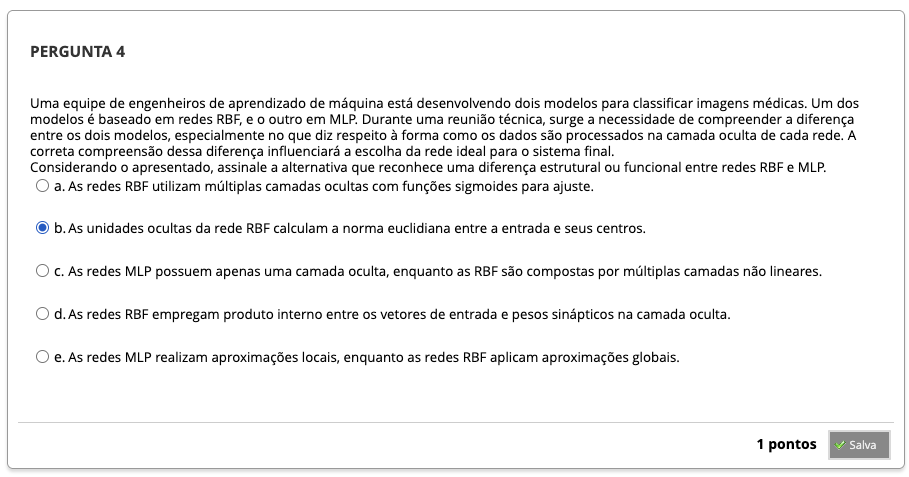
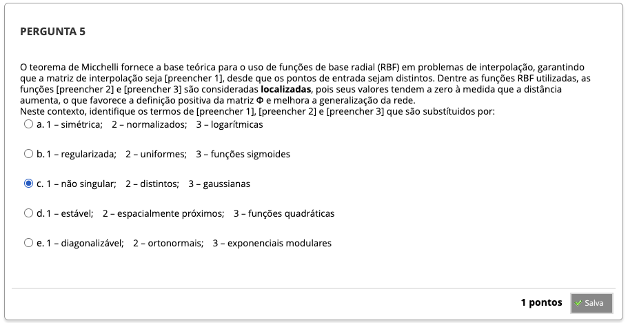
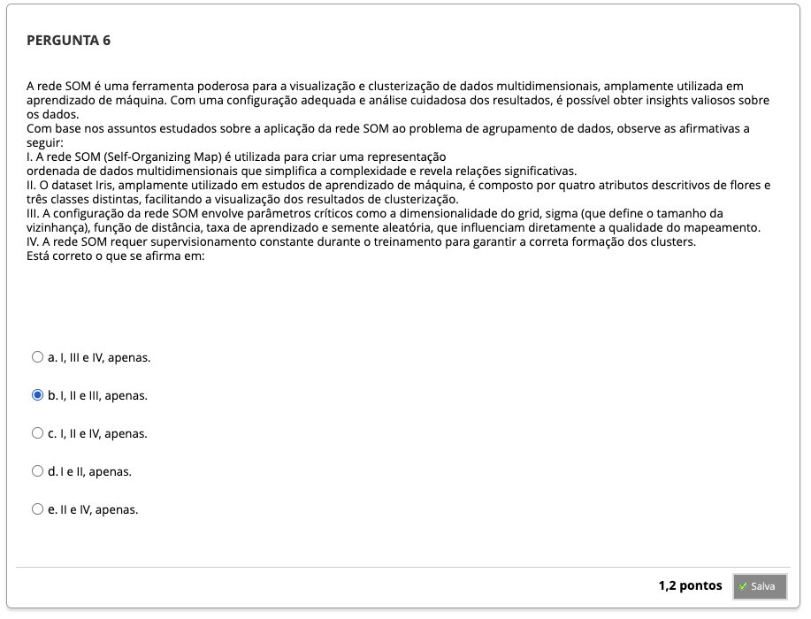
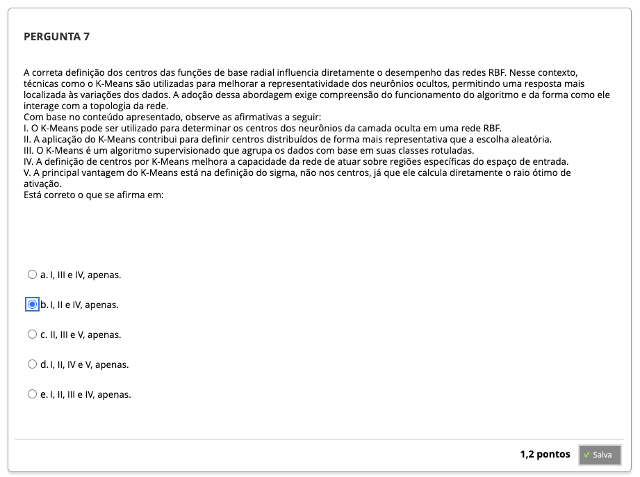

# Semana 5 - Introdução às Redes de Funções de Base Radial (RBF) e aos Mapas Auto-Organizáveis (SOM)

##
### Texto-base 1
### Texto-base 2
### Videoaula 13 - A Arquitetura da Rede RBF e seu Treinamento
#### Quiz - videoaula 13
### Texto-base 3
### Texto-base 4
### Videoaula 14 - O Aprendizado Competitivo e a Rede SOM
#### Quiz - videoaula 14
### Videoaula 15 - A Rede SOM Aplicada ao Problema de Agrupamento de Dados
#### Quiz - videoaula 15

## Quiz Objeto Educacional

## Exercício de Apoio
---
## Aprofundando o Tema
---
## Em Síntese
---

## Atividade Avaliativa - Semana 5

