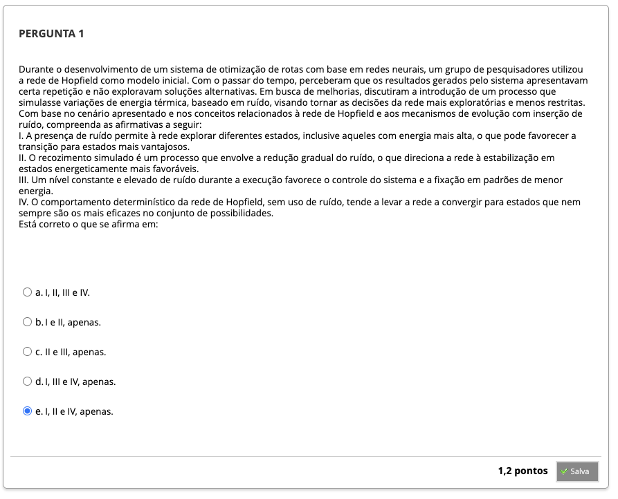
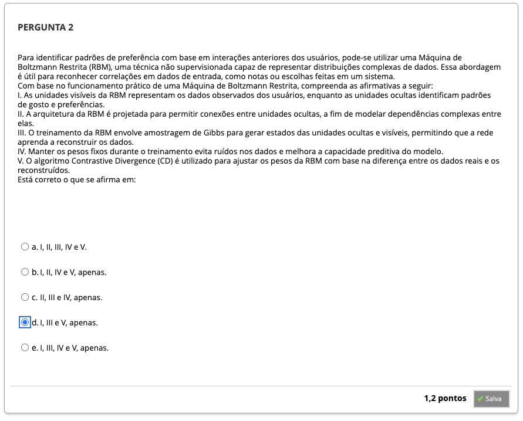
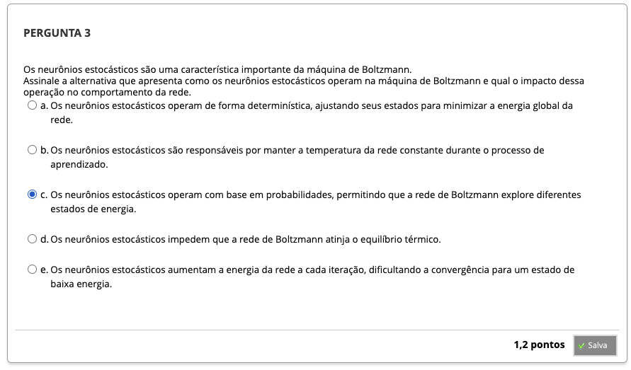
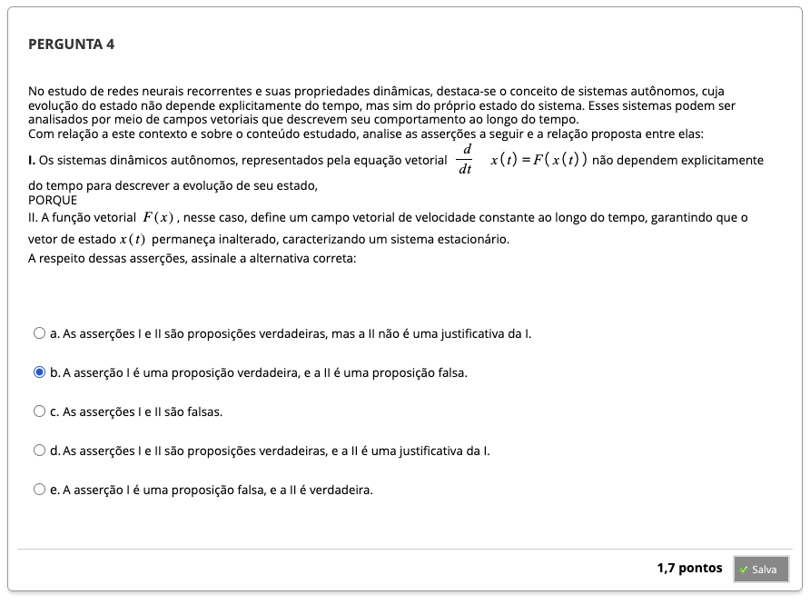
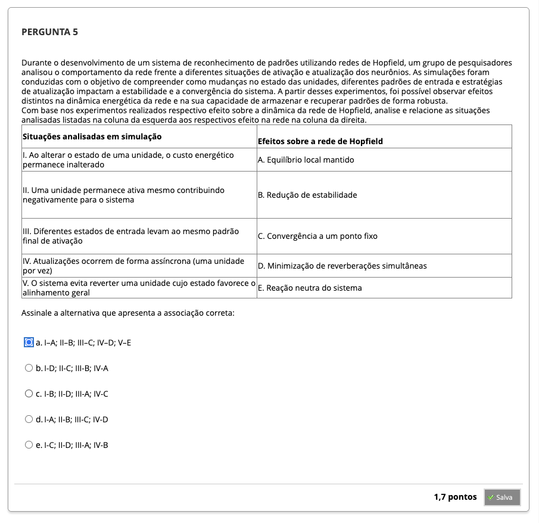
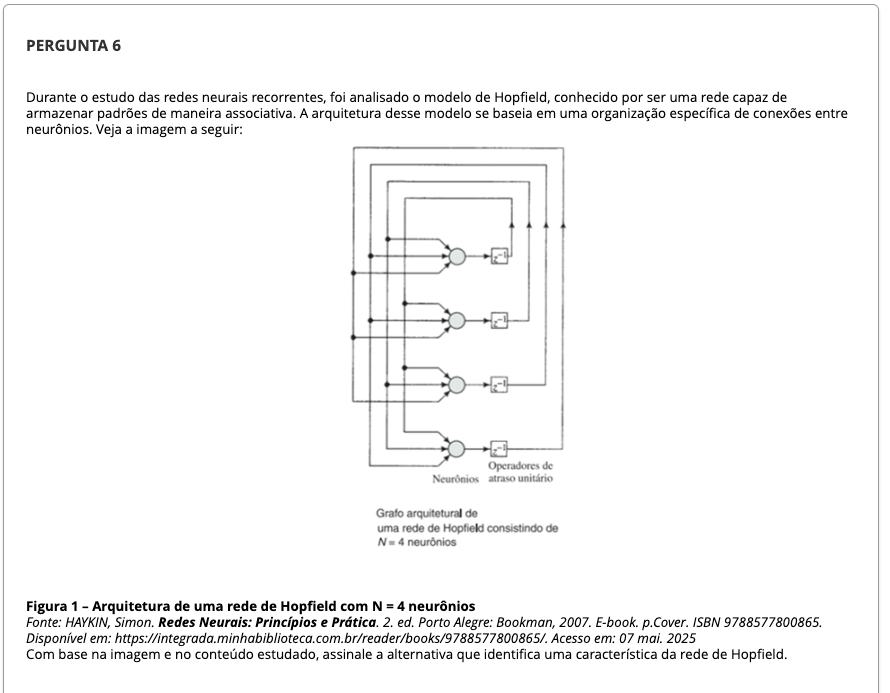
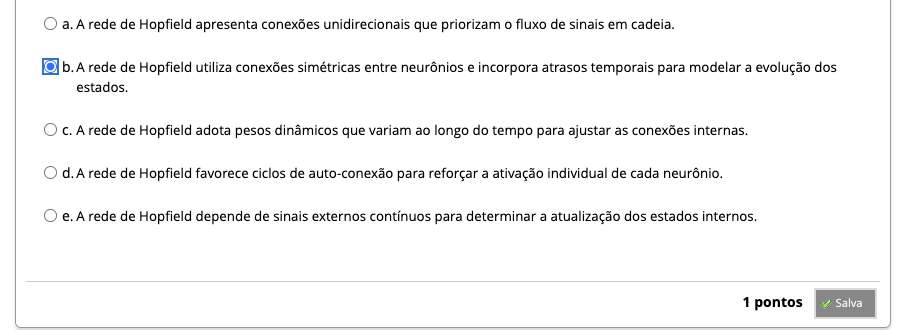
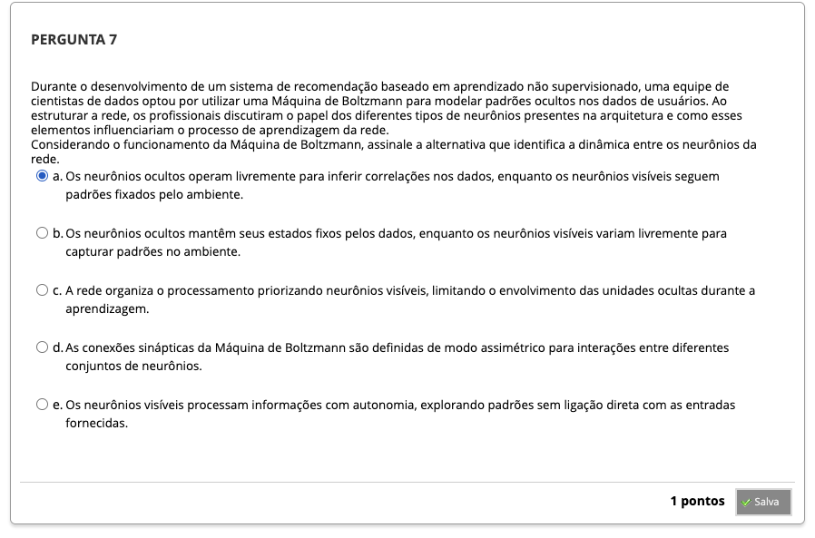

# Semana 6 - Máquinas Baseadas em Energia: Boltzmann e Hopfield

## Desafio

##
### Texto-base 1

### Videoaula 16 - Máquinas Baseadas em Energia: A Rede de Hopfield

#### Quiz - videoaula 16

### Texto-base 2

### Videoaula 17 - A Máquina de Boltzmann
#### Quiz - videoaula 17

### Texto-base 3
### Videoaula 18 - A Máquina Restrita de Boltzmann
#### Quiz - videoaula 18

## Quiz Objeto Educacional

## Aprofundando o Tema

## Em Síntese

---

## Atividade Avaliativa - Semana 6

