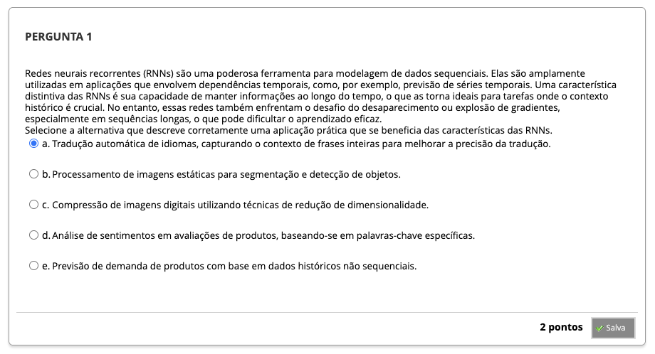
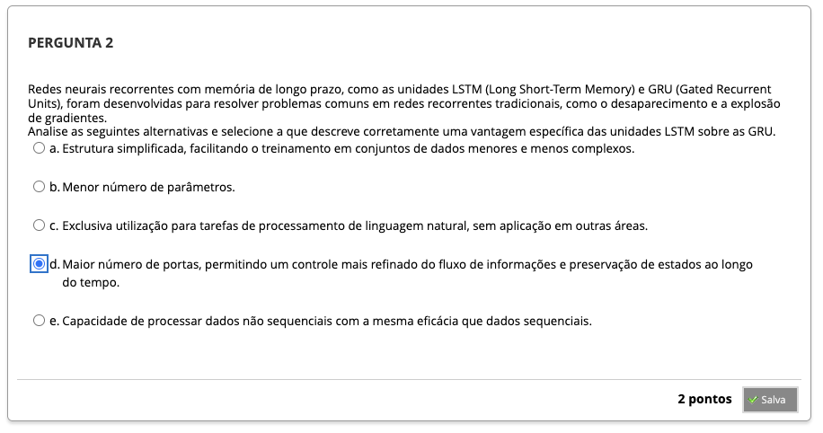
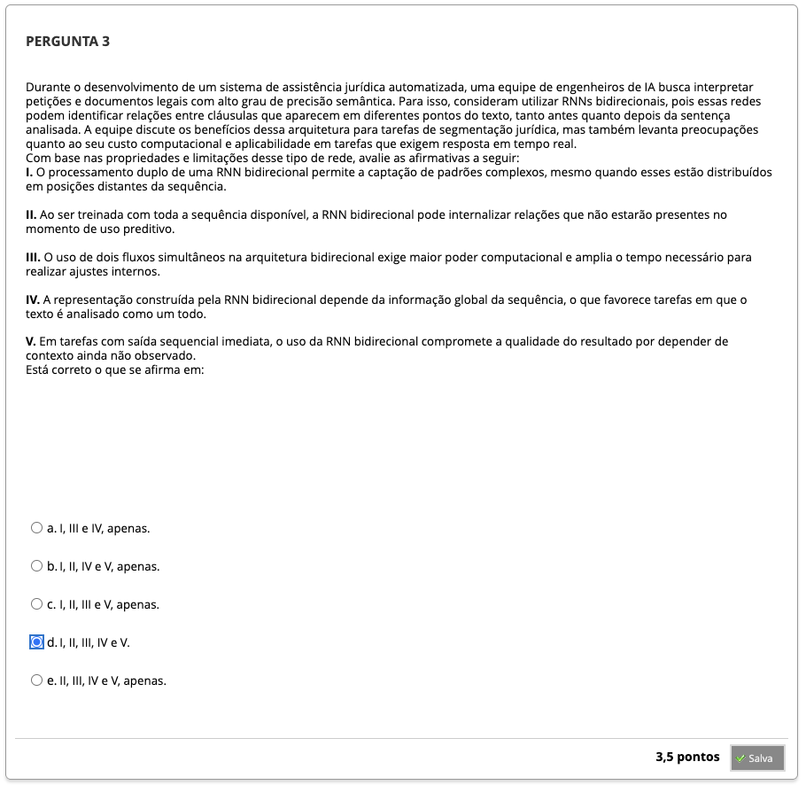
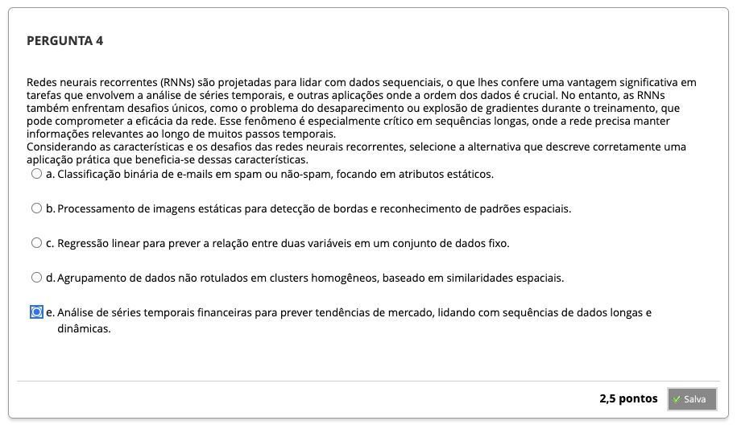

# Semana 7 - Redes Recorrentes e suas Principais Arquiteturas

##
### Texto-base 1
### Texto-base 2
### Videoaula 19 - Redes Recorrentes e o Algoritmo de Retropropagação através do Tempo
#### Quiz - videoaula 19
### Texto-base 3
### Videoaula 20 - Redes Recorrentes com Memória de Longo Prazo
#### Quiz - videoaula 20
### Videoaula 21 - Predição em Séries Temporais usando Redes Recorrentes
#### Quiz - videoaula 21
## Quiz Objeto Educacional
## Exercício de Apoio

## Aprofundando o Tema
### Redes Neurais Recorrentes
### A Matemática do Backpropagation through time (BPTT)
### A Matemática da Dissipação do Gradiente e Aplicações das RNNs
### Arquitetura de Redes Neurais Long Short Term Memory (LSTM)
#### Arquitetura de Redes Neurais Gated Recurrent Unit (GRU)

## Em Síntese

## Atividade Avaliativa - Semana 7

