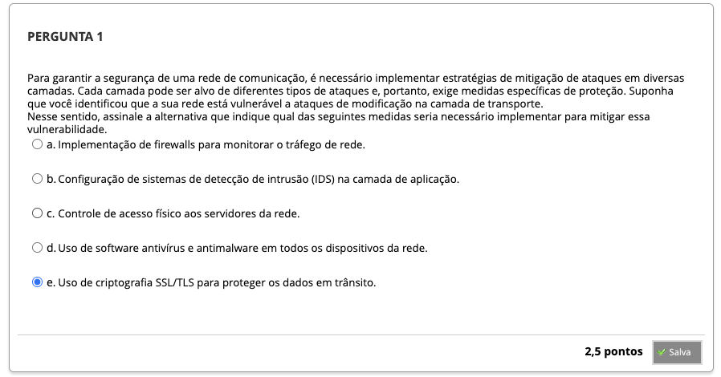
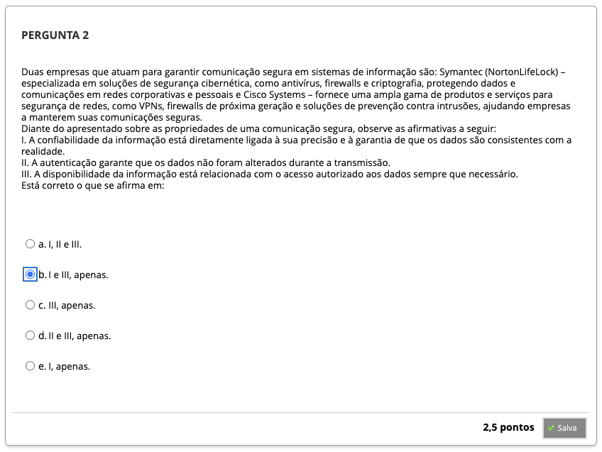
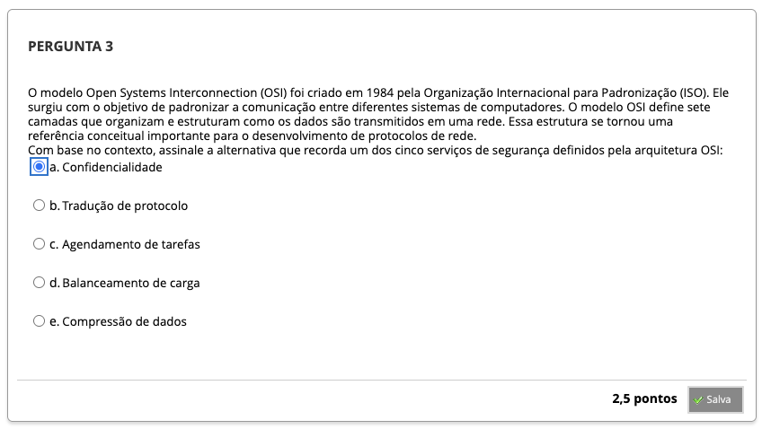

# Semana 1 - Introdução à Segurança da Informação

## Desafio

## Revisitando Conhecimentos
###

### Videoaula 1 - Introdução à Segurança da Informação

### Texto-base 1

### Texto-base 2

### Videoaula 2 - Visões de Segurança

### Texto-base 3

## Aprofundando o Tema

## Em Síntese

## Atividade Avaliativa

