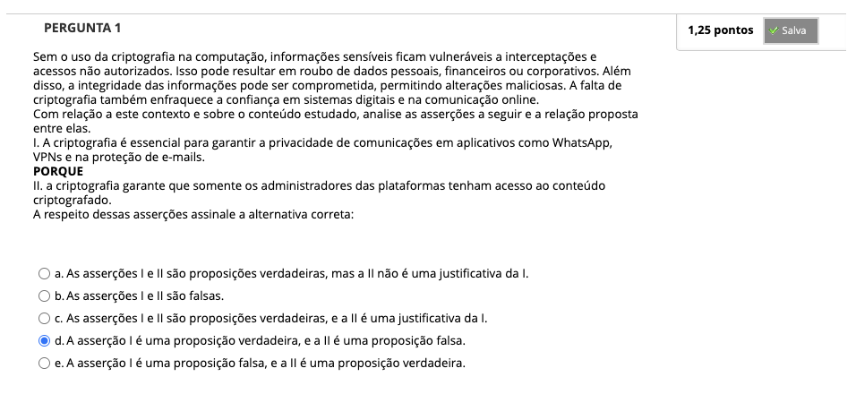
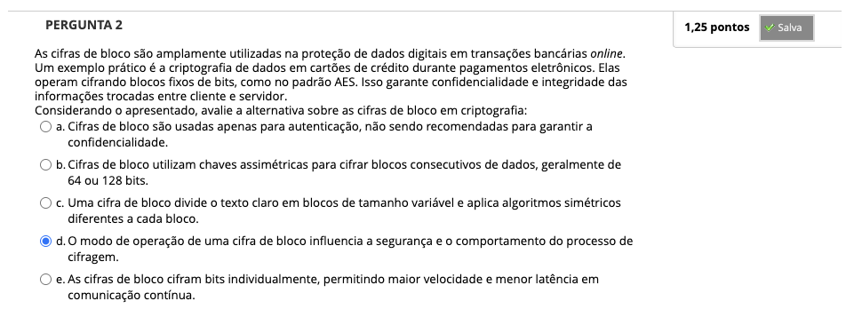
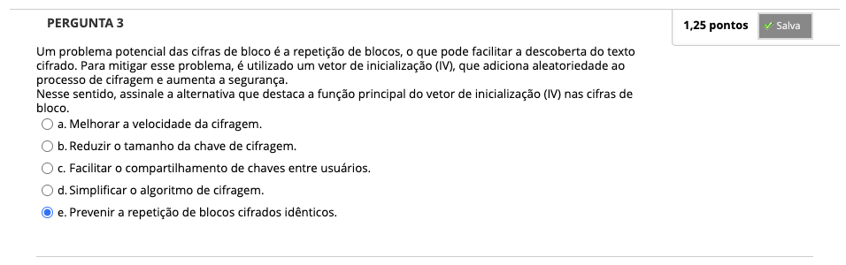
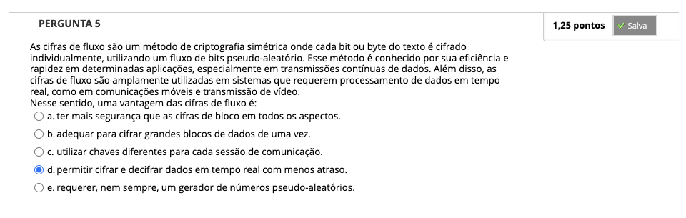
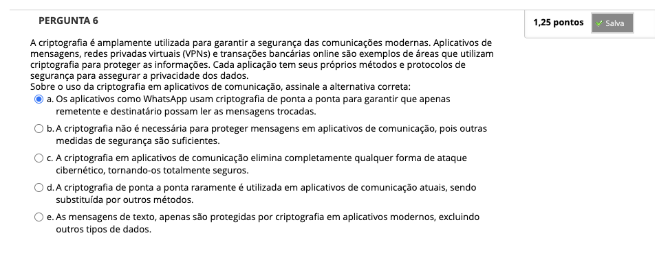
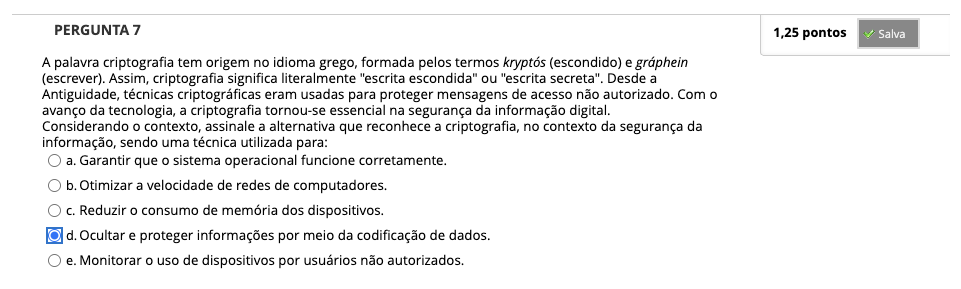
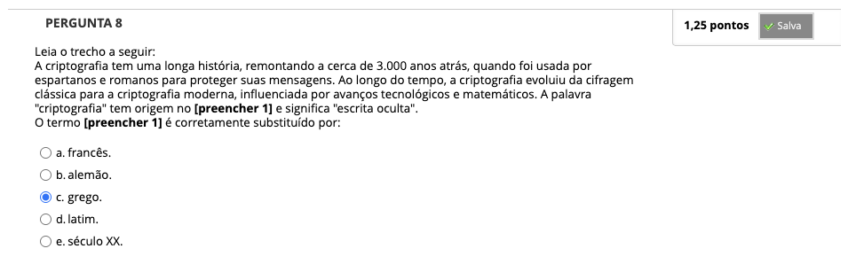

# Semana 2 - Confidencialidade

## Desafio

## Revisitando Conhecimentos
###

##
### Videoaula 3 - Introdução à Criptografia

### Videoaula 4 - Cifras Simétricas

## Aprofundando o Tema
### Texto-base

---

## Em Síntese

---

## Atividade Avaliativa - Semana 2

