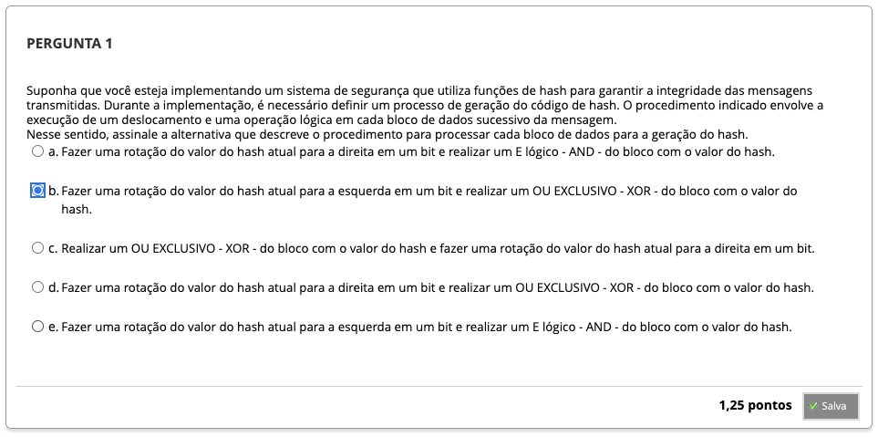
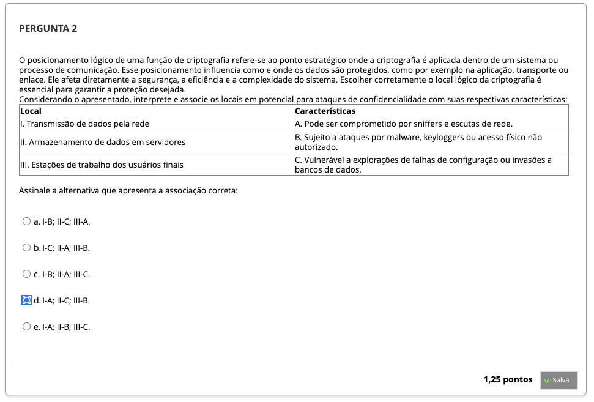
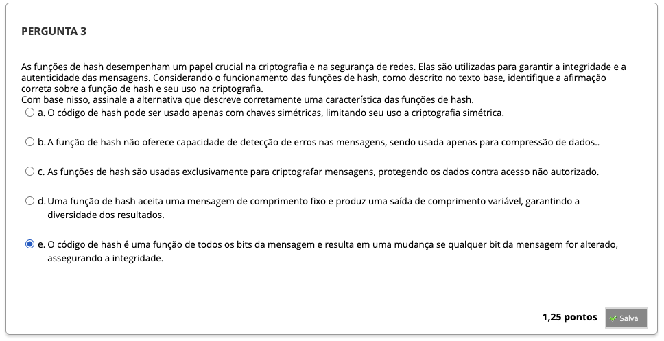
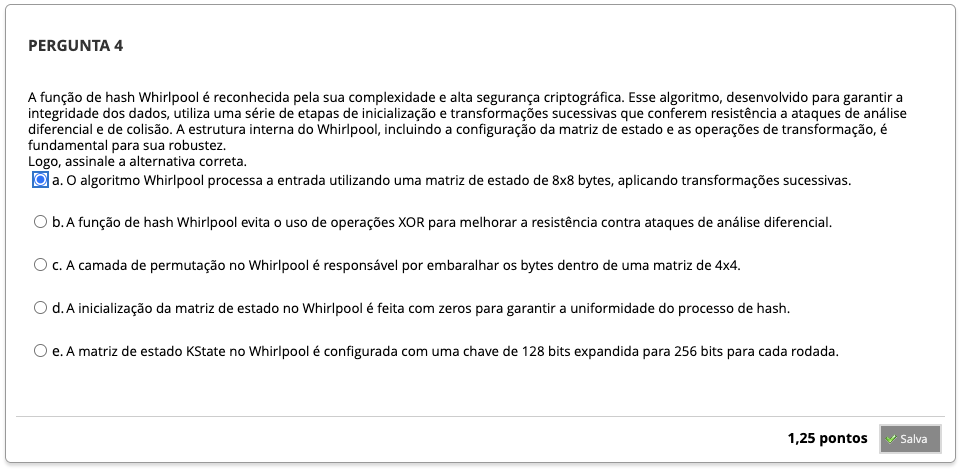
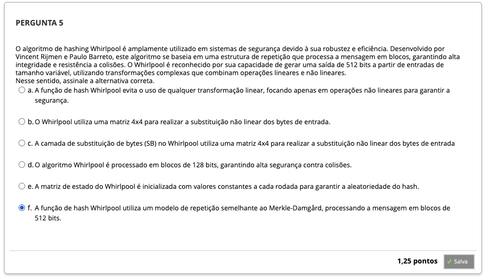
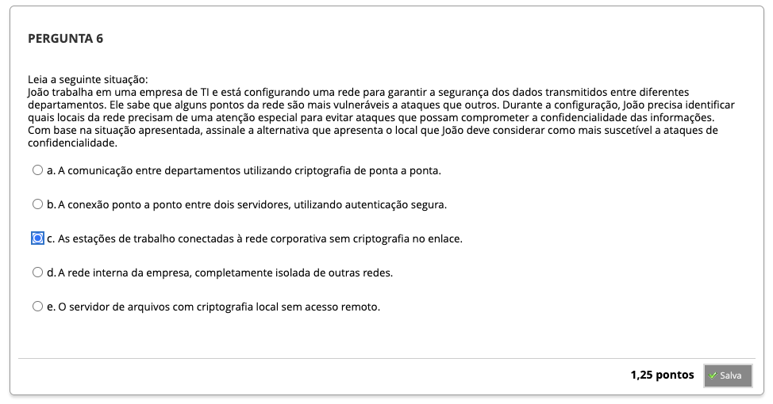
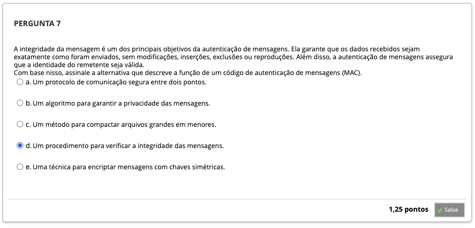
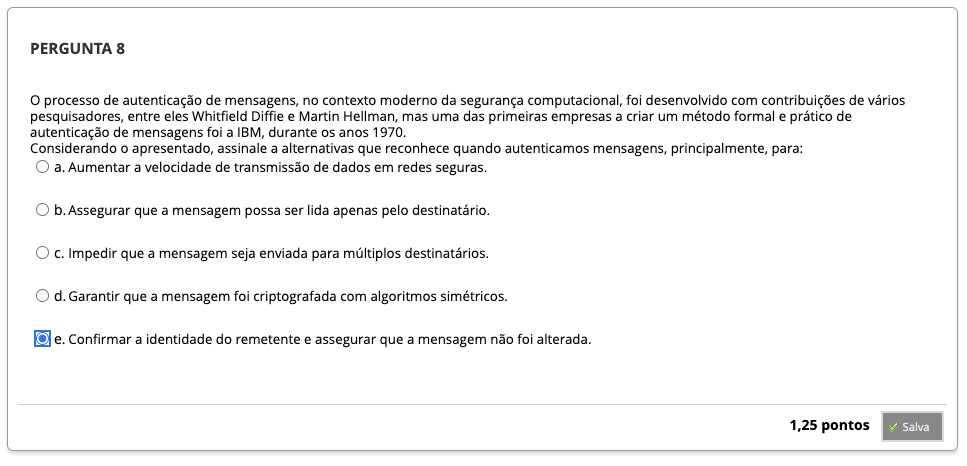

# Semana 3 - Códigos de Autenticação de Mensagens e Funções Hash

## Revisitando Conhecimentos

###

---

## Videoaula 5 - Códigos de Autenticação de Mensagens e Funções Hash
### Quiz - videoaula 5

### Texto-base 1
### Texto-base 2

---

## Aprofundando o Tema

---

## Atividades Práticas
### SHA-256 hash calculator
### MD5 hash calculator
### Hash Calculator Online

---

## Em Síntese

---

## Atividade Avaliativa

