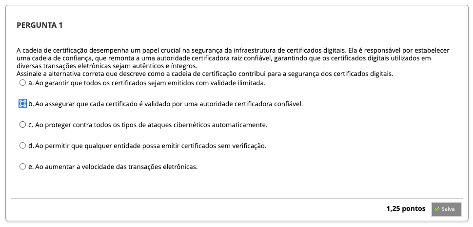
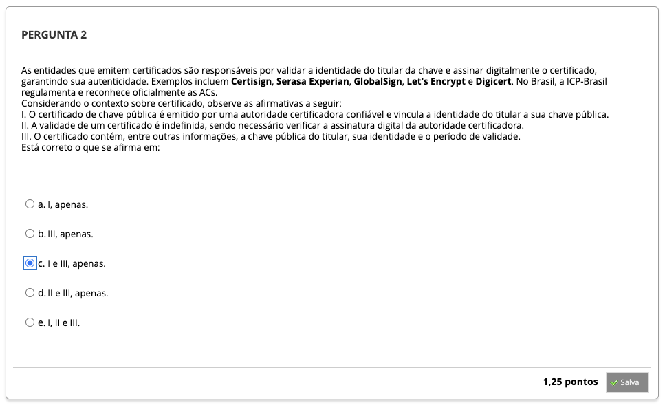
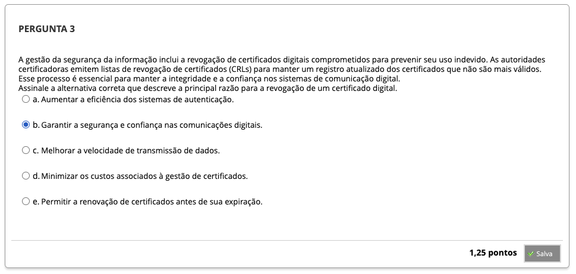
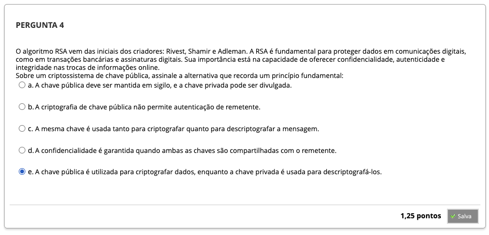
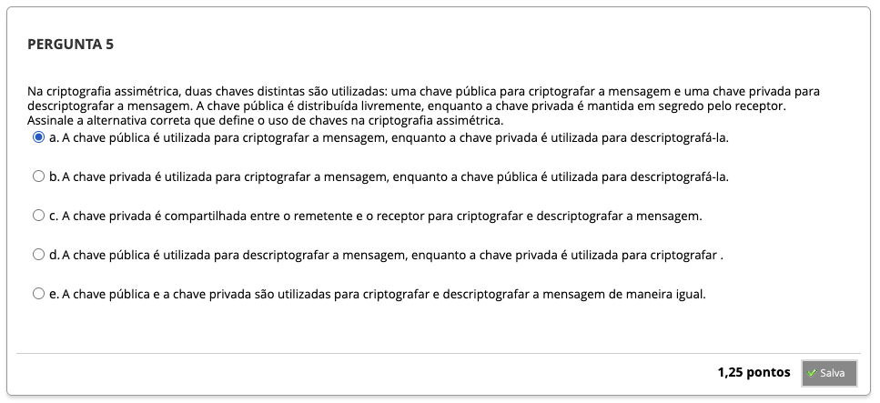
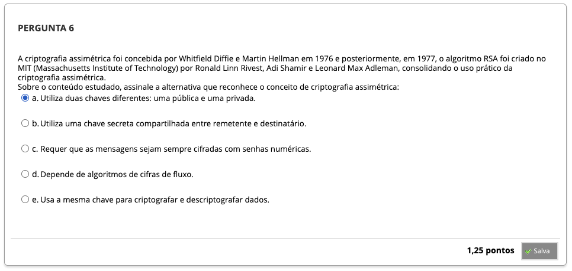
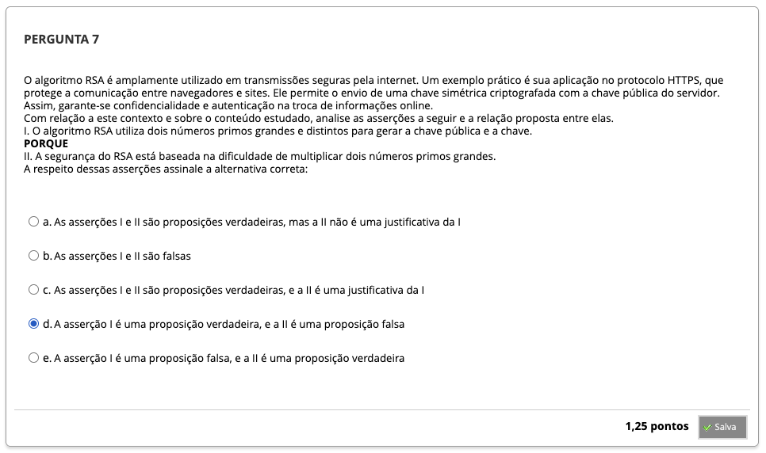
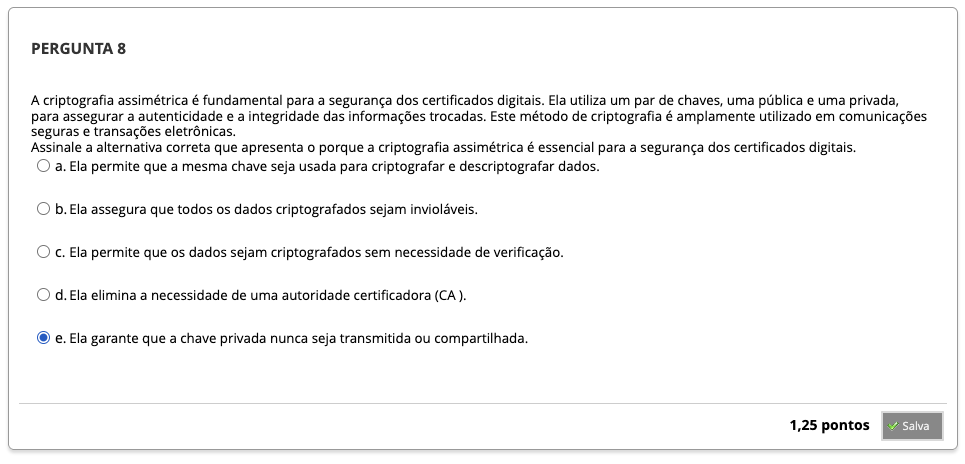

# Semana 4 - Criptografia Assimétrica e Certificados Digitais

## Desafio

## Revisitando Conhecimentos

##
### Videoaula 3 - Introdução à Criptografia

### Videoaula 6 - Criptografia Assimétrica
#### Quiz - videoaula 6
### Videoaula 7 - Certificados Digitais
#### Quiz - videoaula 7
### Texto-base 1
### Texto-base 2

---

## Quiz Objeto Educacional

---

##

---

## Atividades Práticas

---
---

## Em Síntese

---
## Atividade Avaliativa - Semana 4

