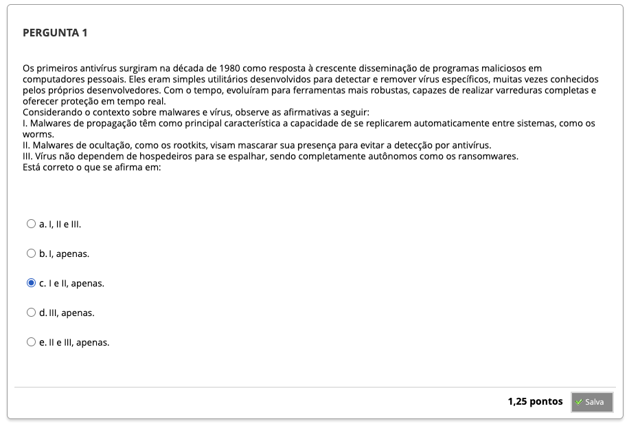
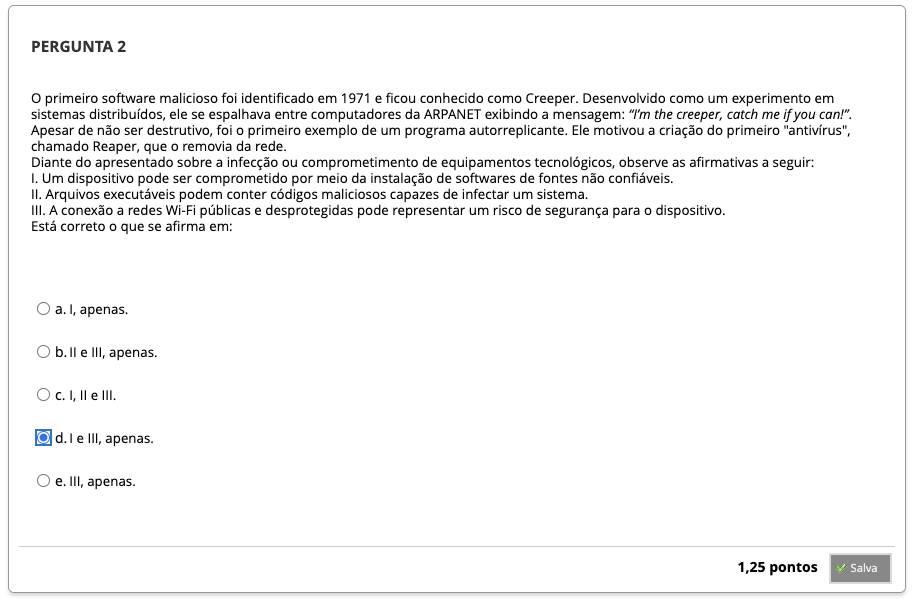
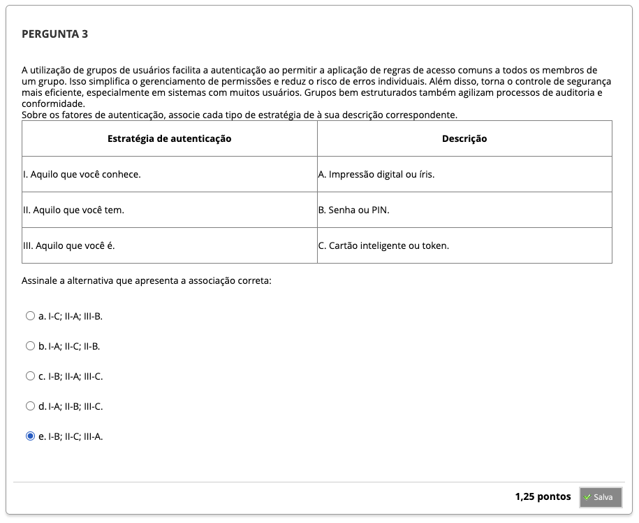
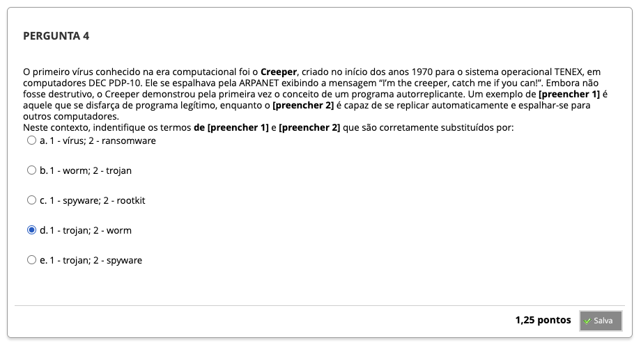
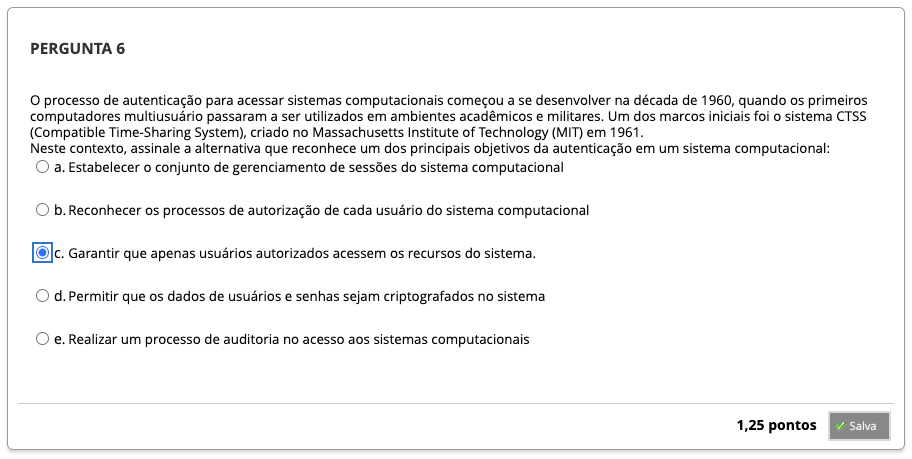
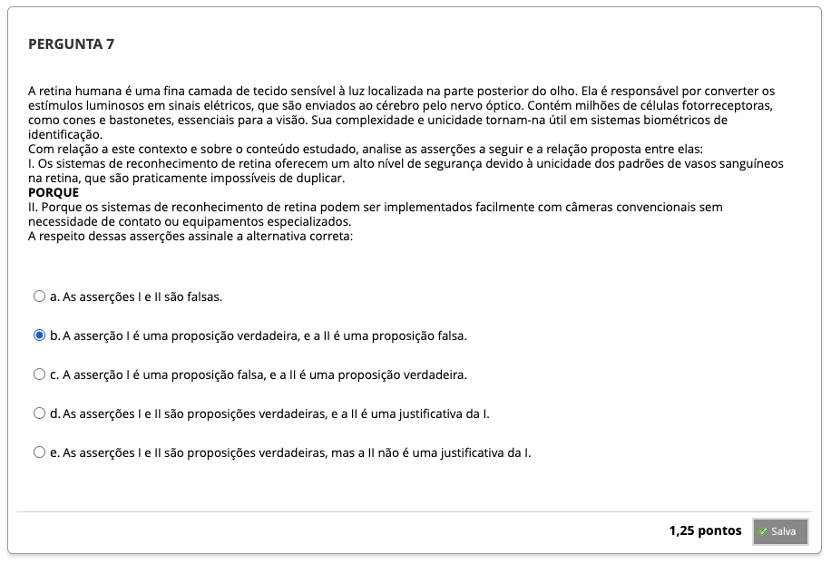
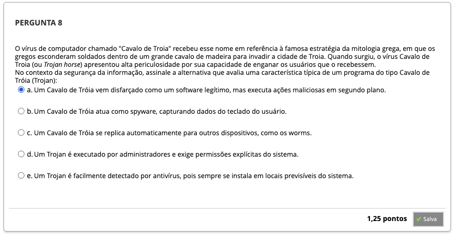

# Semana 5 - Mecanismos de Autenticação e Códigos Maliciosos

## Revisitando Conhecimentos

##
### Videoaula 8 - Mecanismos de Autenticação
#### Quiz - videoaula 8
### Videoaula 9 - Softwares Maliciosos
#### Quiz - videoaula 9
### Texto-base 1
### Texto-base 2

---

## Quiz Objeto Educacional

---

## Aprofundando o tema

---

## Atividades Práticas

---

## Em Síntese

---

## Atividade Avaliativa - Semana 5

