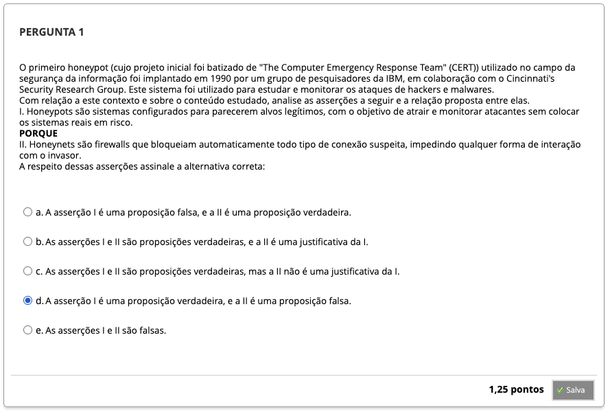
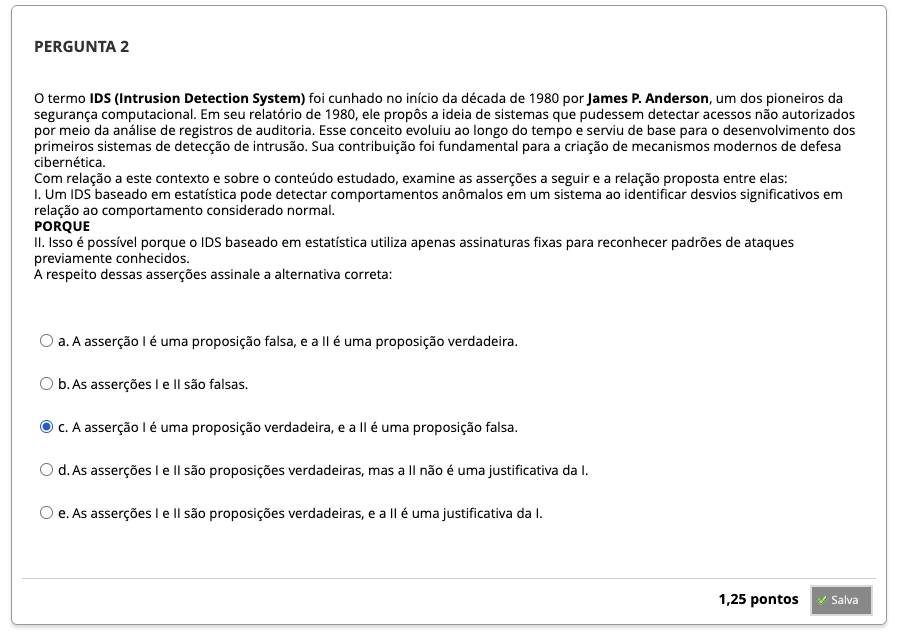
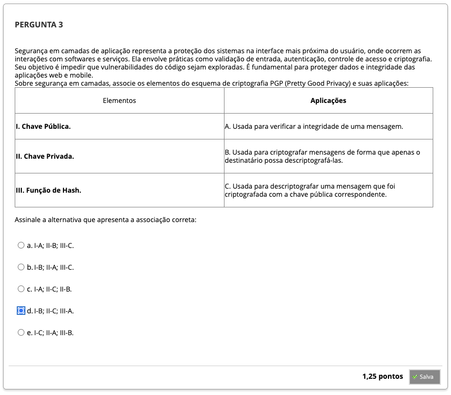
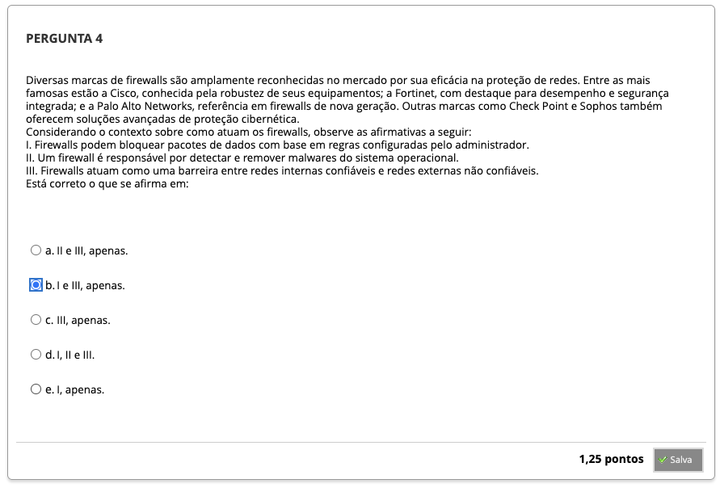
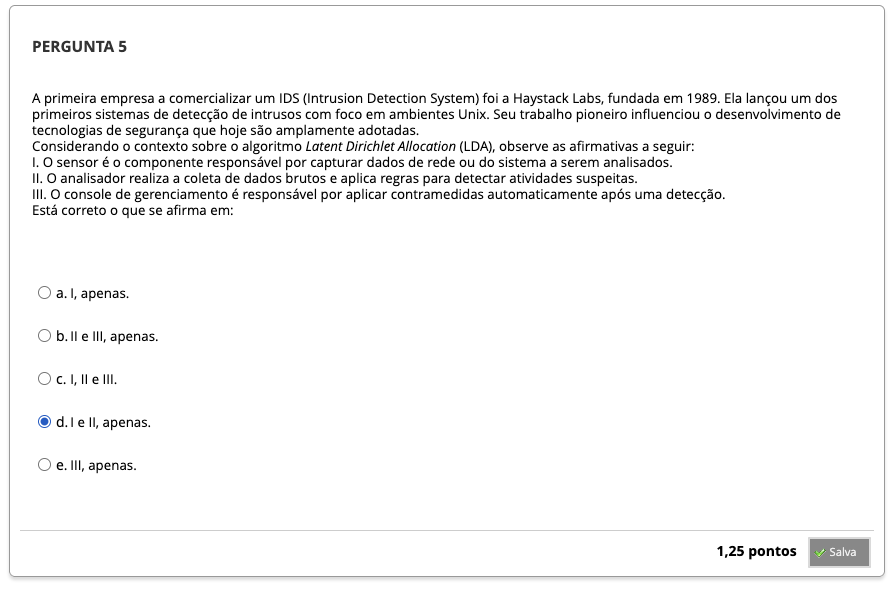
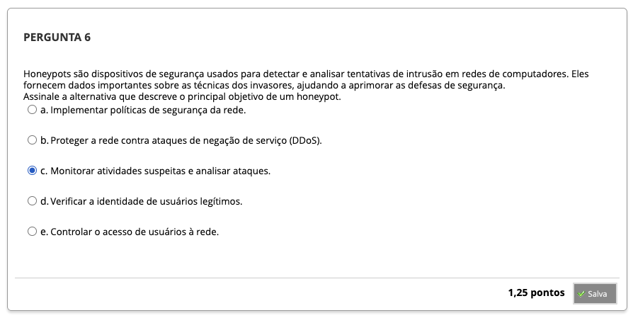
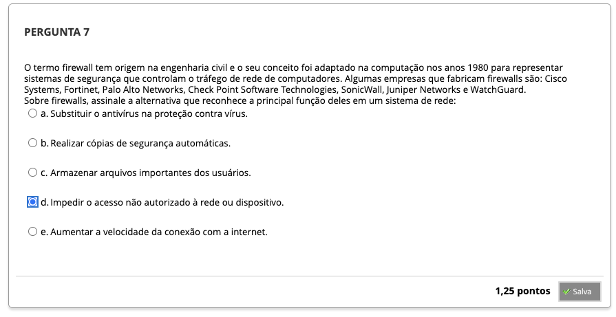
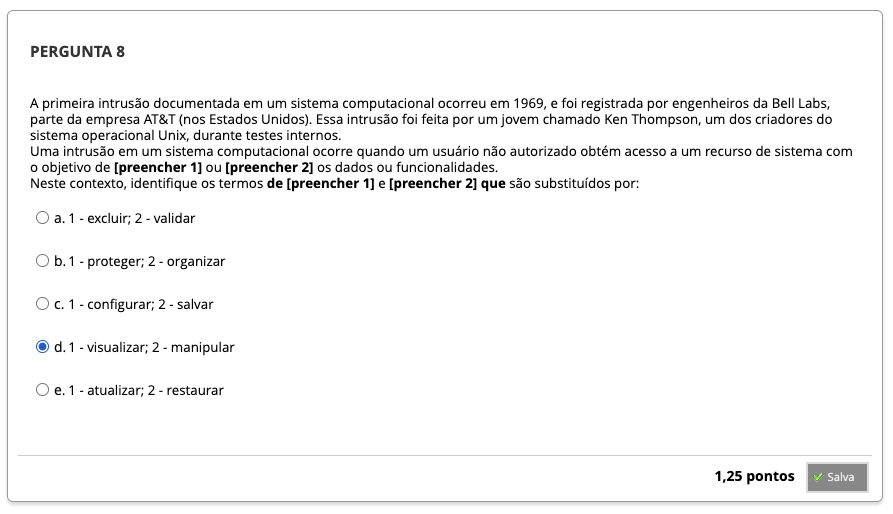

# Semana 6 - Medidas de Segurança

## Desafio

## Revisitando Conhecimentos

##
### Videoaula 10 - Firewalls
#### Quiz - videoaula 10

### Videoaula 11 - IDS e Honeypots
#### Quiz - videoaula 11

### Texto-base 1
### Texto-base 2
### Texto-base 3
### Texto-base 4
### Texto-base 5

## Aprofundando o Tema

## Em Síntese

---

## Atividade Avaliativa - Semana 6

