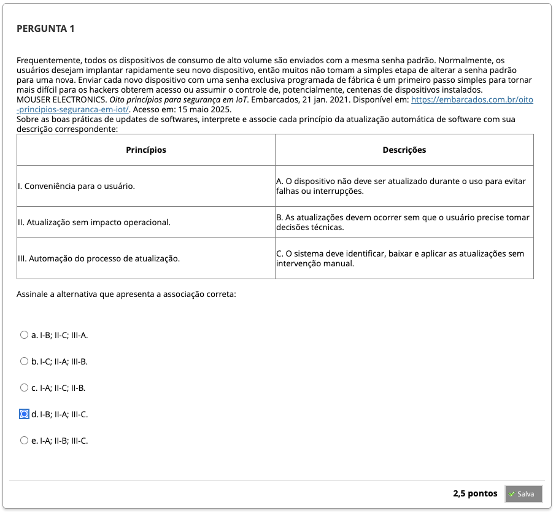
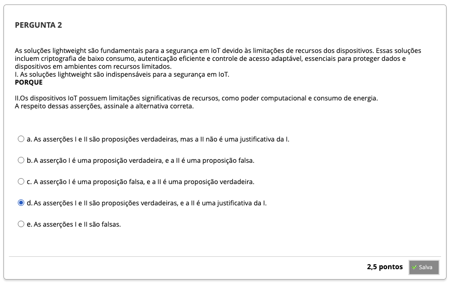
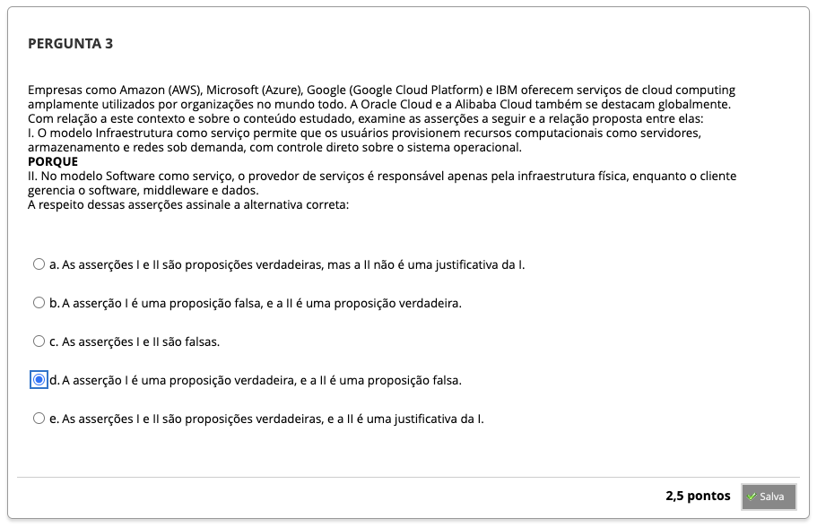
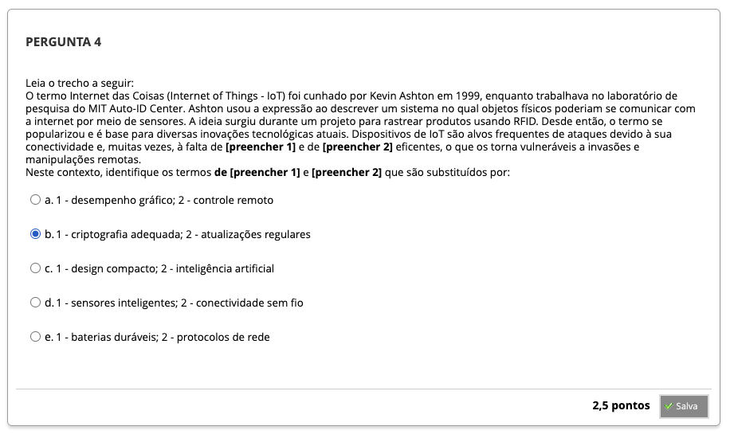

# Semana 7 - Segurança em Nuvem e em Internet das Coisas

## Desafio

## Revisitando Conhecimentos

##
### Videoaula 12 - Segurança em Nuvem
#### Quiz - videoaula 12

### Videoaula 13 - Segurança em IoT
#### Quiz - videoaula 13

### Texto-base 1

### Texto-base 2

### Texto-base 3

### Texto-base 4

### Texto-base 5

### Texto-base 6

## Quiz Objeto Educacional

## Aprofundando o Tema

## Em Síntese

---

## Atividade Avaliativa - Semana 7

