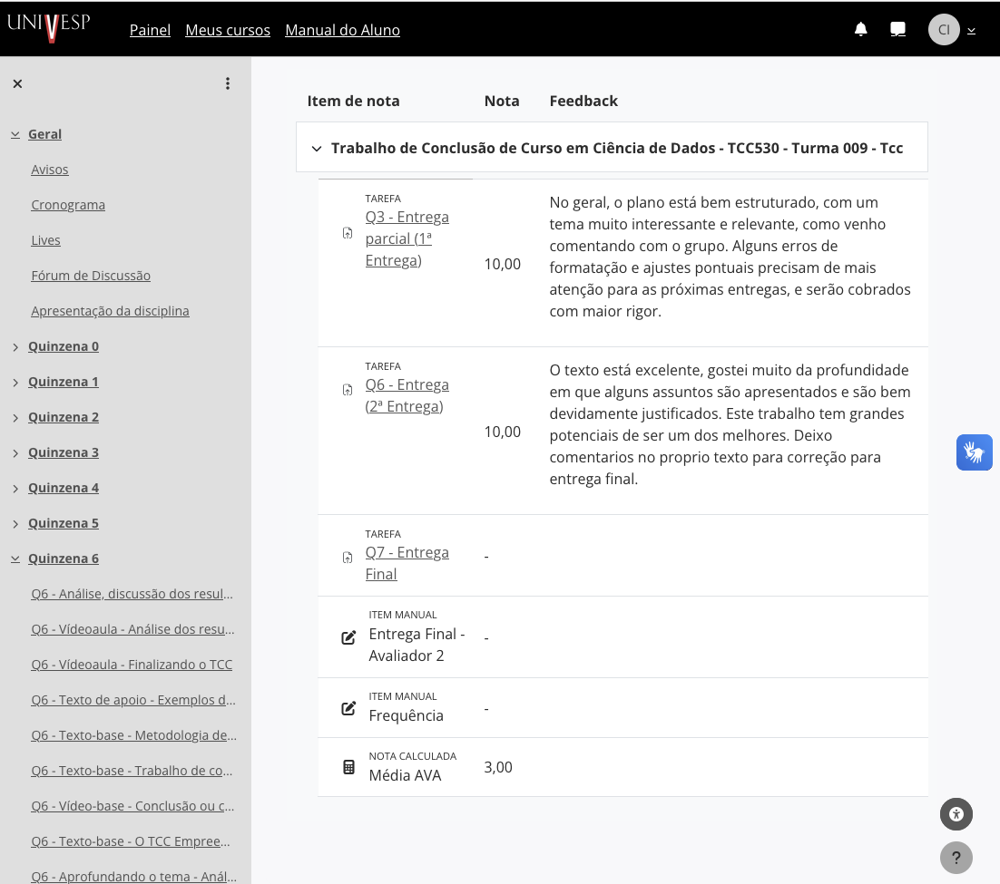
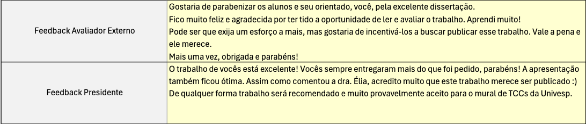

# `Trabalho de Conclusão de Curso`

## Tema
"Vulnerabilidade E Resiliência da Rede de Transporte Público de São Paulo: Uma Análise Topológica Baseada em Teoria dos Grafos"

---

## TCC
https://github.com/cintia-shinoda/univesp/blob/master/TCC/TCC.pdf

## Repositório
https://github.com/cintia-shinoda/public-transit-graph-theory

---

## Entregas

|     | Entrega | Prazo | Nota da Entrega | Parcial |
|:---:|:---:|:-----:|:---:|:---:|
| &check; | [Projeto de Pesquisa](https://github.com/cintia-shinoda/univesp/blob/master/TCC/1_Projeto-de-Pesquisa/Projeto-de-Pesquisa.pdf) | 07/04/2026 | 10 / 10 | 1,5 / 1,5 |
| &check; | [2ª Entrega](https://github.com/cintia-shinoda/univesp/blob/master/TCC/2_2a-Entrega/2a-Entrega.pdf) | 19/05/2026 | 10 / 10 | 1,5 / 1,5 |
| &check; | [3ª Entrega](https://github.com/cintia-shinoda/univesp/blob/master/TCC/TCC.pdf) | 02/06/2026 | 10 / 10 | 7 / 7 |
| - | **Nota Final** | - | - | **10,0 / 10,0** |

---

## Temas das Quinzenas

| Quinzena | Data | Tema |
|:---:|:---:|:---|
| 1 | 02/03/2026 | Escolhendo um Tema |
| 2 | 16/03/2026 | Delimitação do Tema e Objetivos |
| 3 | 30/03/2026 | <ul><li>Material e Métodos</li><li>**1ª Entrega**</li></ul> |
| 4 | 13/04/2026 | Pesquisas |
| 5 | 27/04/2026 | Coleta de Dados |
| 6 | 11/05/2026 | <ul><li>Análise, Discussão dos Resultados e Considerações Finais</li><li>**2ª Entrega**</li></ul> |
| 7 | 25/05/2026 | <ul><li>Revisão Final</li><li>**3ª Entrega**</li></ul> |

##

## Projeto de Pesquisa + 2ª Entrega

## *Feedback*
